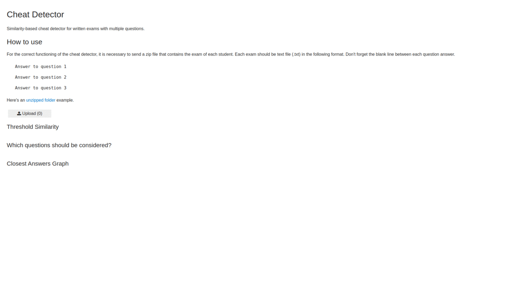

# Cheat Detector
Similarity-based cheat detector for written exams with multiple questions.

**Número da Lista**: X<br>
**Conteúdo da Disciplina**: Grafos 1<br>

## Alunos
|Matrícula | Aluno |
| -- | -- |
| 17/0146251  |  João Lucas Zarbiélli |
| 19/0046945  |  Leonardo Michalski Miranda |

## About
The cheat detector works using text similarity. Once multiple exams are uploaded, the detector analyzes each question from all exams and compares them, finding the degree of similarity between student responses, thus creating a similarity matrix that is analogous to an adjacency matrix and so using it to draw a graph that connects students. At the edges there is a percentage of similarity between the vertex students' exams.


## App Gif


## Video (brazilian portuguese)
<video width="320" height="240" controls>
  <source src="assets/cheat_detector_app_video.mp4" type="video/mp4">
</video>

## How to run
**Language**: Python.<br>
**Frameworks**: SentenceTransformers; PyTorch; scikit-learn; Jupyter Voilà; BinderHub.<br>
Access the [app](https://mybinder.org/v2/gh/projeto-de-algoritmos/Grafos1_Joao_Lucas_Leonardo_Miranda/main?urlpath=%2Fvoila%2Frender%2Fdetector_de_cola.ipynb) or the [notebook](https://mybinder.org/v2/gh/projeto-de-algoritmos/Grafos1_Joao_Lucas_Leonardo_Miranda/main?filepath=detector_de_cola.ipynb) with the BinderHub server.

## How to use
For the correct functioning of the cheat detector, it is necessary to send a zip file that contains the exam of each student. Each exam should be text file (.txt) in the following format. Don't forget the blank line between each question answer.

```
Answer to question 1

Answer to question 2

Answer to question 3
```

Here's an [unzipped folder](https://github.com/projeto-de-algoritmos/Grafo1_Joao_Lucas_Leonardo_Miranda/blob/main/mock_data/prova_2) example.


## References

Jupyter et al., "Binder 2.0 - Reproducible, Interactive, Sharable
Environments for Science at Scale." Proceedings of the 17th Python
in Science Conference. 2018. doi://10.25080/Majora-4af1f417-011

Nils Reimers and Iryna Gurevych. 2019. [SentenceBERT: Sentence
embeddings using Siamese BERT-networks.](http://arxiv.org/abs/1908.10084)
In Proceedings of the 2019 Conference on Empirical Methods in Natural
Language Processing and the 9th International Joint Conference on Natural
Language Processing (EMNLP-IJCNLP), pages 3982–3992, Hong Kong, China.
Association for Computational Linguistics.

Reimers, N.; and Gurevych, I. 2020. Making Monolingual Sentence Embeddings
Multilingual using Knowledge Distillation. arXiv preprint arXiv:2004.09813
[URL](http://arxiv.org/abs/2004.09813).
